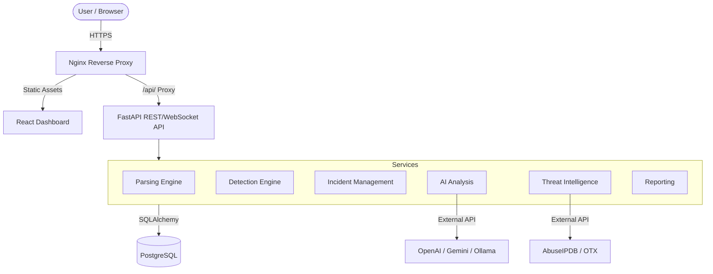
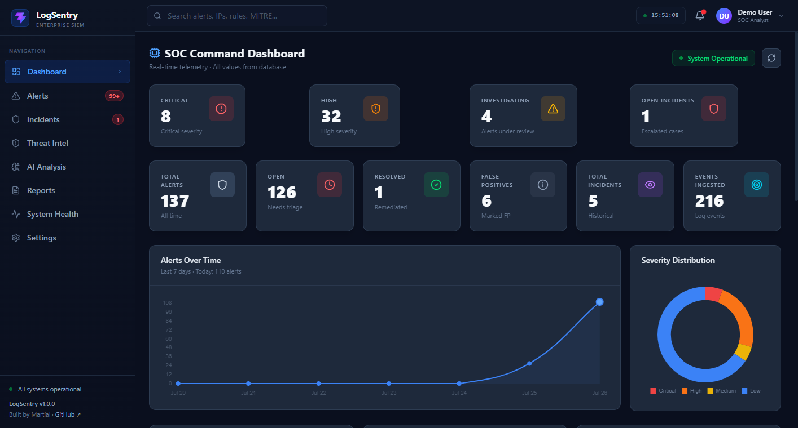
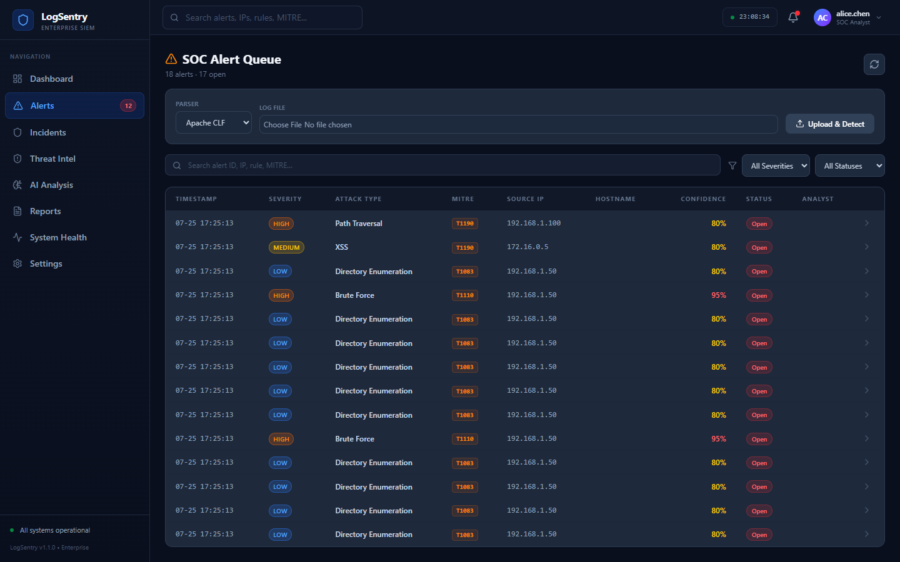
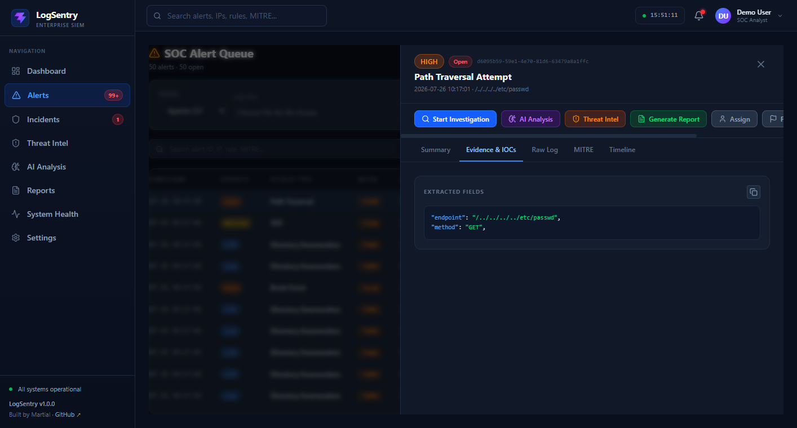
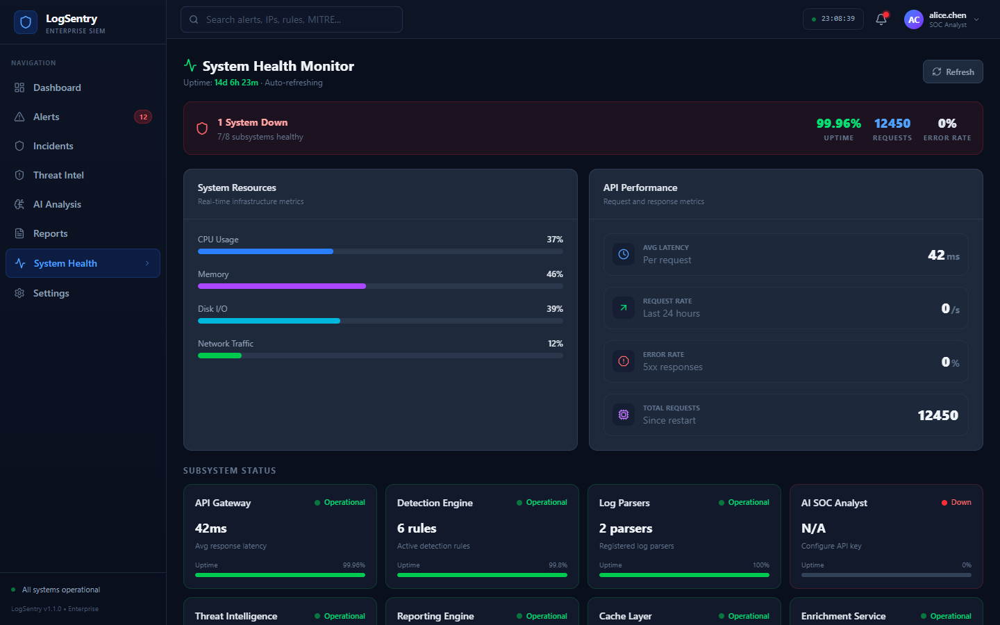
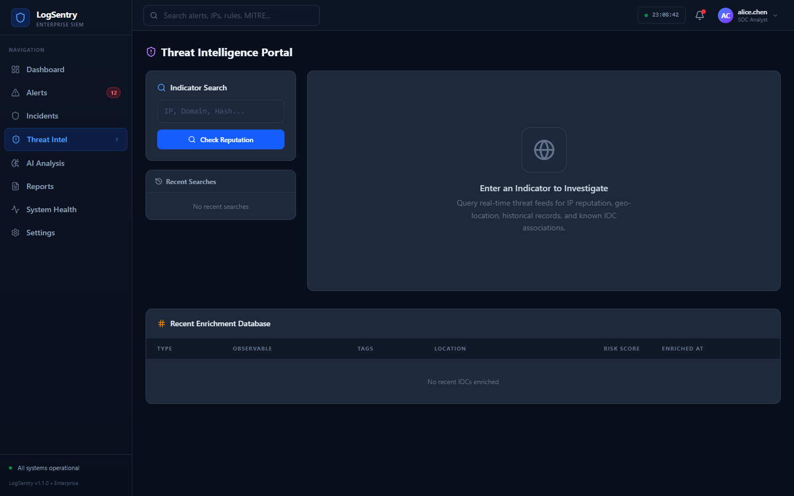
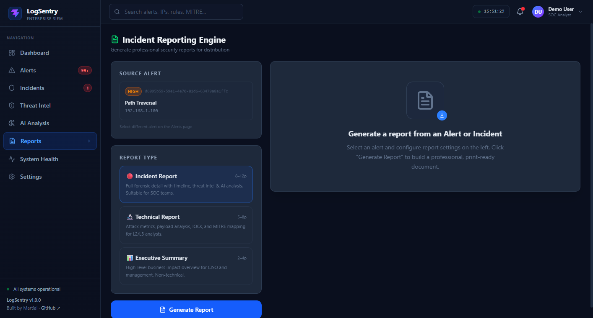

<p align="center">
  
</p>

<h1 align="center">LogSentry</h1>
<p align="center"><strong>Enterprise SIEM — AI-assisted Security Monitoring & Incident Response</strong></p>
<p align="center">
  Built by <a href="https://github.com/kharbashpriyanshu/LogSentry">Martial</a> · MIT License · v1.0.0
</p>

AI-assisted Security Information and Event Management platform for log ingestion, threat detection, incident investigation and security analytics.

## Overview
LogSentry is a high-performance SIEM designed for modern SOC teams. It ingests raw security logs, automatically detects cyber attacks using strict rule engines, enriches indicators of compromise (IOCs) with real-time threat intelligence, runs AI-driven incident analysis for triage, and surfaces actionable data via a real-time React dashboard.

## Key Capabilities
- **Apache/Nginx log ingestion**
- **Log parsing and normalization**
- **SQL Injection detection**
- **XSS detection**
- **Path Traversal detection**
- **Command Injection detection**
- **Directory Enumeration detection**
- **Brute Force detection**
- **Alert lifecycle management** (Assign, Comment, Resolve, False Positive)
- **Incident management** (linked alerts, comments, timeline)
- **Threat Intelligence enrichment** (AbuseIPDB, OTX, MITRE ATT&CK)
- **AI-assisted SOC analysis** (Gemini, OpenAI)
- **Real-time WebSocket updates**
- **Reporting** (PDF, JSON Executive & Technical exports)
- **System health monitoring**
- **SQLite (local) / PostgreSQL (production) persistence**
- **Alembic migrations**
- **React SOC dashboard**

## Architecture



## Detection Pipeline
The detection flow processes raw strings into actionable security intelligence:
1. **Log Input:** Raw logs are ingested via file upload or stream.
2. **Parser:** The string is parsed and normalized into standard fields (IP, Timestamp, Endpoint, etc.).
3. **Detection Engine:** The normalized event passes through the Rule Registry.
4. **Rule Match:** Specific attack classes (e.g., SQLi, XSS, Path Traversal, Command Injection) are detected using RegEx constraints or temporal correlation (Brute Force).
5. **Alert & Persistence:** A high-confidence Alert is generated and saved to PostgreSQL.
6. **Event Publication:** The new record triggers a database commit and subsequent WebSocket broadcast.
7. **Dashboard:** The SOC analyst sees the alert instantly on the React dashboard.

## Technology Stack

**Backend**
- Python 3.11+
- FastAPI
- Pydantic v2
- SQLAlchemy
- Alembic

**Database**
- SQLite (local development)
- PostgreSQL (production / Docker Compose)

**Frontend**
- React
- TypeScript
- Vite
- Tailwind CSS
- TanStack Query (React Query)
- Lucide React

**Infrastructure**
- Docker
- Docker Compose
- Nginx

**Testing**
- Pytest

**Security/Intelligence**
- AbuseIPDB
- AlienVault OTX
- MITRE ATT&CK mapping
- Configurable AI Providers (OpenAI, Gemini, Ollama)

## Screenshots
Screenshots of the fully integrated LogSentry SIEM platform:

### 1. Unified Dashboard


### 2. Incident & Alert Management



### 3. System Health & Infrastructure


### 4. Real-time Threat Intelligence


### 5. Automated Reporting Engine


*(Note: The AI Analysis module screenshot is currently not displayed in this demo due to missing provider configuration during the automated capture.)*
## Security Architecture
LogSentry implements strict production security controls:
- **Production fail-fast configuration:** Will not start in `production` without explicitly setting `DATABASE_URI`.
- **Restricted CORS:** Configurable allowed origins.
- **Security Headers:** Strict deployment of `CSP`, `HSTS`, `X-Frame-Options`, `X-Content-Type-Options`, `Referrer-Policy`, and `Permissions-Policy` via middleware and Nginx.
- **Upload validation:** Explicit request-size limits to prevent buffer overflow or DoS attacks.
- **Non-public PostgreSQL:** PostgreSQL is bound only to the internal Docker network in `docker-compose.prod.yml`.

## Project Structure
```text
logsentry/
├── app/                  # FastAPI Application Code
│   ├── api/              # REST Endpoints and WebSockets
│   ├── detection/        # Security Rules Engine
│   ├── models/           # SQLAlchemy DB Models
│   ├── services/         # Core Business Logic
│   └── ...
├── frontend/             # React SPA
│   ├── src/pages/        # Dashboard Views
│   ├── Dockerfile        # Nginx Production Build
│   └── nginx.conf        # Proxy & Security Config
├── tests/                # Pytest Test Suite
├── alembic/              # Database Migrations
├── docs/                 # Platform Documentation
├── DEPLOYMENT.md         # Deployment Guide
└── docker-compose.*      # Container Orchestration
```

## Local Development
1. **Clone the repository:**
   ```bash
   git clone https://github.com/kharbashpriyanshu/LogSentry.git
   cd LogSentry
   ```
2. **Environment Configuration:**
   Copy `.env.example` to `.env` and fill in dummy API keys for local testing.
3. **Backend Startup:**
   ```bash
   python -m venv venv
   source venv/bin/activate  # On Windows: venv\Scripts\activate
   pip install -r requirements.txt -r requirements-dev.txt
   alembic upgrade head
   uvicorn app.main:app --reload
   ```
4. **Frontend Startup:**
   ```bash
   cd frontend
   npm install
   npm run dev
   ```

## Production Deployment
Please see [DEPLOYMENT.md](DEPLOYMENT.md) for full instructions.
Production deployment utilizes a multi-container Docker Compose stack comprising PostgreSQL, the FastAPI backend, and an Nginx reverse proxy serving the production React build. 

## API Documentation
When running locally, automatic interactive API documentation is available at:
- Swagger UI: `http://localhost:8000/docs`
- ReDoc: `http://localhost:8000/redoc`

## Testing
The backend test suite leverages Pytest to ensure reliability.
- **Backend Tests:** 127 passing tests
- **Coverage:** 84.14%

To run the test suite:
```bash
pytest tests/ --cov=app
```

## Production Status
**v1.0.0 — Release Ready**

Verified features:
- Backend test suite (127 tests passing)
- Frontend production build (0 TypeScript errors)
- Configuration fail-fast behavior
- Persistence logic through automated tests
- Security controls through tests/code inspection
- AI Analysis via Gemini API
- Threat Intelligence via AbuseIPDB and OTX
- Full SOC workflow (Assign → Comment → Investigate → Resolve)

Pending environment-level verification:
- Live PostgreSQL deployment orchestration
- Docker Compose orchestration execution
- Nginx runtime routing
- Container restart persistence
- WebSocket behavior through production Nginx

## License
This project is licensed under the MIT License - see the [LICENSE](LICENSE) file for details.

## Creator
Built by **Martial** — [GitHub Repository](https://github.com/kharbashpriyanshu/LogSentry)

## Contact & Documentation
Detailed audit and technical reports can be found in `docs/audits/`. For contributing guidelines or security vulnerability reporting, please see `CONTRIBUTING.md` and `SECURITY.md`.
