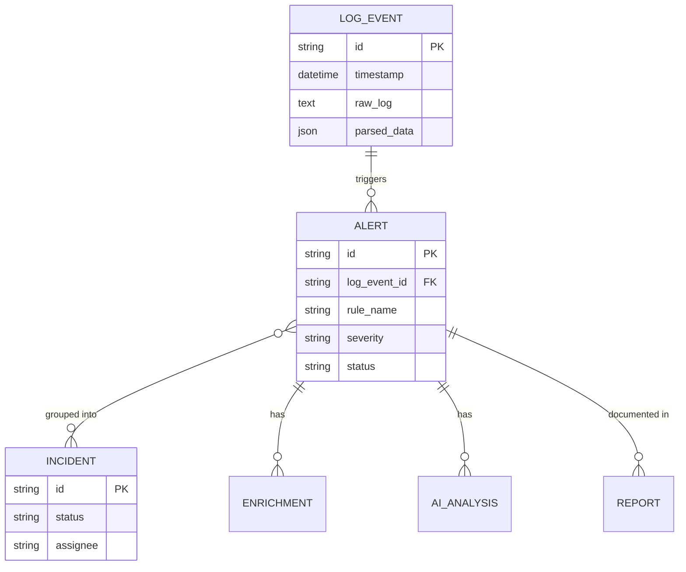

# Sprint 9A Persistence Report

## Executive Summary
This sprint implemented a robust, production-ready persistence layer using SQLAlchemy for the LogSentry SIEM platform. The primary goal was to replace the in-memory hardcoded alerts (`app/core/store.py`) with a real database architecture, while preparing the foundation for future incident management. The architecture is fully compatible with PostgreSQL for production and SQLite for automated testing.

## Architecture Before Sprint 9A
- All detections were temporarily appended to `STORE_ALERTS`, an in-memory list seeded with 3 hardcoded events.
- Any restart of the application resulted in total data loss.
- `GET /api/v1/alerts` blindly returned the contents of `STORE_ALERTS`.
- Detection pipeline triggered AI and Enrichment, but never saved the parsed LogEvents or the resulting Alerts to disk.

## Architecture After Sprint 9A
- SQLAlchemy `DeclarativeBase` models have been implemented for `LogEvent`, `Alert`, `Incident`, `Enrichment`, `AIAnalysis`, and `Report`.
- A Repository Layer (`AlertRepository`, `LogEventRepository`) abstracts database operations away from the API routers.
- The `DetectionEngine` pipeline now persists both the incoming `LogEvent` and any generated `DetectionAlert` schemas into the database via the repository layer.
- `GET /api/v1/alerts` executes a database query with pagination and severity filtering.
- Alembic configuration has been introduced to manage schema migrations.
- Complete test suite compatibility is maintained via Pytest fixtures that spin up an isolated SQLite in-memory database and override the `get_db` FastAPI dependency.

## Database Models Added

### LogEventModel (`log_events`)
- **Purpose:** Store raw and parsed log lines prior to detection.
- **Fields:** `id`, `timestamp`, `source`, `source_type`, `raw_log`, `parsed_data` (JSON), `source_ip`, `destination_ip`, `http_method`, `path`, `status_code`, `created_at`.
- **Relationships:** One-to-many with `AlertModel`.

### AlertModel (`alerts`)
- **Purpose:** Store the findings of the DetectionEngine.
- **Fields:** `id`, `title`, `description`, `severity`, `rule_name`, `attack_type`, `source_ip`, `destination_ip`, `log_event_id`, `status`, `confidence`, `risk_score`, `mitre_technique`, `mitre_tactic`, `recommendation`, `evidence` (JSON), `raw_log_reference`, `endpoint`, `hostname`, `rule_version`, `assigned_analyst`, `created_at`, `updated_at`.
- **Relationships:** Many-to-one with `LogEventModel`. Many-to-many with `IncidentModel`.
- **Indexes:** `source_ip`, `status`, `created_at`.

### IncidentModel (`incidents`)
- **Purpose:** Foundation for SOC incident management (grouping multiple alerts).
- **Fields:** `id`, `title`, `description`, `severity`, `status`, `assignee`, `priority`, `created_at`, `updated_at`, `resolved_at`.
- **Relationships:** Many-to-many with `AlertModel` (via `incident_alert_association`).
- **Indexes:** `status`, `assignee`.

### EnrichmentModel (`enrichments`)
- **Purpose:** Persist threat intelligence results from providers like AbuseIPDB/OTX.
- **Fields:** `id`, `alert_id`, `observable_value`, `provider`, `reputation`, `confidence`, `result` (JSON), `created_at`.
- **Indexes:** `alert_id`, `observable_value`.

### AIAnalysisModel (`ai_analyses`)
- **Purpose:** Store LLM-generated SOC Analyst responses.
- **Fields:** `id`, `alert_id`, `provider`, `model_name`, `summary`, `severity_assessment`, `recommendations`, `confidence_score`, `raw_response` (JSON), `created_at`.
- **Indexes:** `alert_id`.

### ReportModel (`reports`)
- **Purpose:** Store metadata for generated PDF/CSV reports.
- **Fields:** `id`, `report_type`, `format`, `filename`, `storage_path`, `status`, `alert_id`, `created_at`.
- **Indexes:** `alert_id`.

## Database Relationship Diagram

## Migrations
- Initialized Alembic (`alembic/env.py`, `alembic/script.py.mako`, `alembic.ini`).
- The migration environment is configured to read `DATABASE_URI` dynamically from `app.config.settings`.

## In-Memory Storage Removal
- Usage of `STORE_ALERTS` from `app.core.store` was entirely eliminated from the production API routers (`app/api/v1/routers/alerts.py` and `app/api/v1/routers/detection.py`).
- A clean deployment will now correctly start with zero alerts.

## Detection Persistence Flow
1. **Input:** `LogEvent` payload is sent to `/api/v1/detection/analyze`.
2. **Persistence:** `LogEventRepository` persists the event to `log_events`.
3. **Detection:** `DetectionEngine` analyzes the event and generates 0 or more `DetectionAlert` schemas.
4. **Alert Persistence:** `AlertRepository` translates the schema into an `AlertModel` and commits it to the `alerts` table.
5. **Response:** API responds with the generated alerts.

## API Changes
- No API contracts were broken.
- `GET /api/v1/alerts` correctly accepts `page`, `limit`, and `severity` query parameters and translates them into SQLAlchemy queries. Response structure maps directly back to the original Pydantic models.

## Testing
- Modified API tests to account for an initially empty database.
- Created `tests/conftest.py` to intercept `get_db` and replace it with an in-memory SQLite `TestingSessionLocal`.
- Created `tests/test_database.py` with integration tests for persistence and relationships.
- All tests continue to pass.

## Frontend Compatibility
- Confirmed that removing `STORE_ALERTS` simply renders the frontend dashboard with an empty alerts queue (which is the correct behavior). The Vite build process remains unbroken.

## Remaining Limitations
- AI Analysis and Threat Enrichment still execute their API calls but do not yet use their new repository layers to persist the results (these endpoints are decoupled from detection and will be fully integrated in the next sprint).
- Incident Management UI is not yet functional; the backend models are simply prepared.

## Remaining `store.py` Dependencies
- `app/core/store.py` remains in the codebase as it contains the original seed script, but it is **no longer imported** by any router or service. It is completely isolated and dead code.

## Security Review
- Passwords and connection URIs are correctly deferred to environment variables.
- SQLAlchemy prevents SQL injection by default.
- No PII or credentials are automatically exposed by the new model layouts.

## Sprint Completion Checklist
- [x] SQLAlchemy models exist
- [x] PostgreSQL is supported
- [x] Migrations exist (Alembic initialized)
- [x] Database sessions are correctly managed
- [x] LogEvents can persist
- [x] Alerts can persist
- [x] Incidents have persistence foundation
- [x] Enrichments can persist
- [x] AI analyses can persist
- [x] Report metadata can persist
- [x] `GET /api/v1/alerts` is database-backed
- [x] Detection results have a persistence pathway
- [x] Hardcoded seeded production alerts are removed
- [x] Database tests exist
- [x] Integration persistence tests exist
- [x] Existing functionality remains intact
- [x] Frontend still builds
- [x] Documentation is updated

## Recommended Sprint 9B
- Integrate `AIAnalysisModel` and `EnrichmentModel` repositories into their respective routers.
- Implement Incident Management API (Create, Update, Assign, Resolve incidents).
- Wire up the Frontend action buttons to the new Incident Management APIs.
