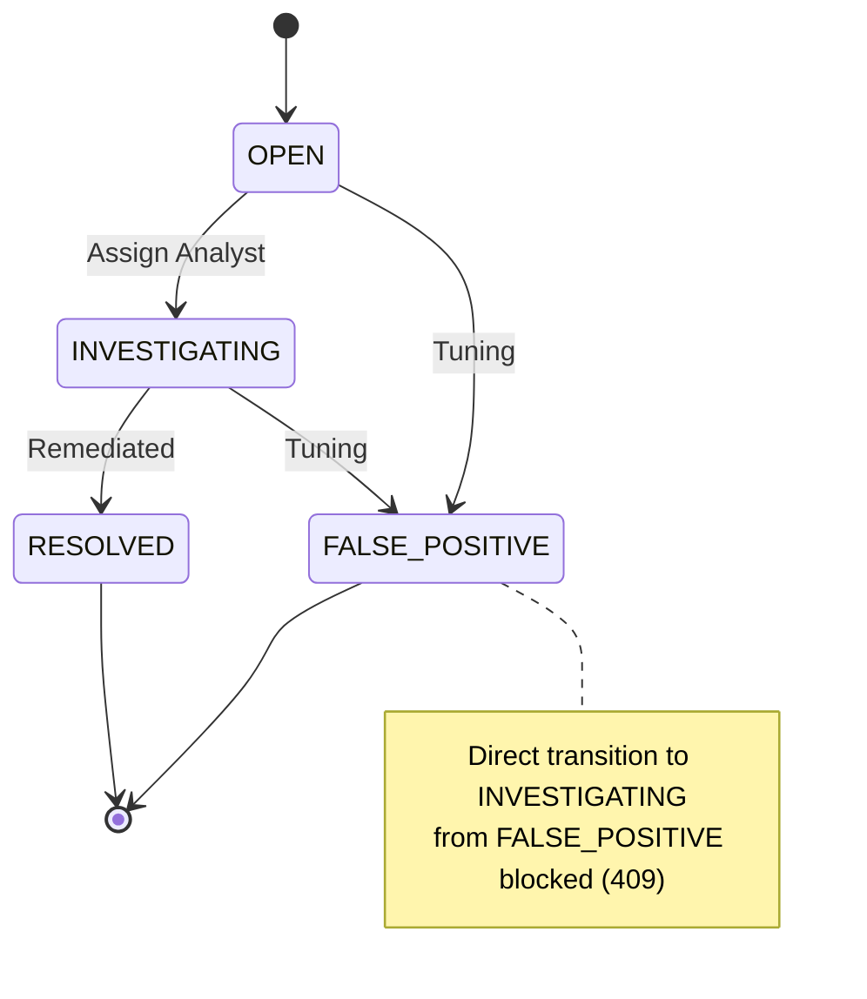

# Sprint 9B: Incident Management Report

## Executive Summary
This sprint implemented a complete backend SOC workflow for Alert lifecycle management and Incident tracking. The architecture extends the foundation established in Sprint 9A by introducing robust lifecycle constraints, alert-to-incident escalation capabilities, and a comprehensive chronological timeline (audit trail). The RESTful API endpoints are designed to safely support the frontend's operational needs while adhering to strict architectural invariants.

## Alert Lifecycle Architecture
The alert lifecycle is strictly managed via the `PATCH /api/v1/alerts/{alert_id}` endpoint.
- **Allowed Transitions:** Alerts begin in the `OPEN` state. They can be updated to `INVESTIGATING`, `RESOLVED`, or `FALSE_POSITIVE`.
- **Validation:** Attempting a silent transition from `FALSE_POSITIVE` to `INVESTIGATING` yields a `409 Conflict`.
- **Resolution:** Moving an alert to a terminal state (`RESOLVED` or `FALSE_POSITIVE`) automatically records the terminal `resolved_at` timestamp. Analyst assignments are persisted and properly audited.

## Incident Architecture
A fully persistent Incident Management layer was constructed.
- **Service Stack:** Incident CRUD operates via `app/api/v1/routers/incidents.py`, brokered by the `IncidentRepository`, interfacing with the `IncidentModel` SQLAlchemy abstraction.
- **Relationship:** Incidents map to zero-or-more Alerts.
- **CRUD Capabilites:** 
  - `POST /api/v1/incidents` (Create with associated alerts)
  - `GET /api/v1/incidents` (Paginated listing with status filter)
  - `GET /api/v1/incidents/{incident_id}` (Retrieve specific incident)
  - `PATCH /api/v1/incidents/{incident_id}` (Update incident status, assignee, or escalate more alerts into it)

## Database Changes
- **AlertModel updates:** Added `resolved_at` (datetime) and `resolution_note` (string).
- **TimelineEventModel added:** Created `app/models/timeline.py` to persist audit activity. It logs `entity_type`, `entity_id`, `action`, `actor`, `old_value`, `new_value`, and `metadata_json`.

## API Endpoints Added
| Method | Endpoint | Purpose | Status |
|---|---|---|---|
| PATCH | `/api/v1/alerts/{alert_id}` | Partial alert update (status, assignee, resolution_note) | Active |
| GET | `/api/v1/alerts/{alert_id}/timeline` | Retrieve chronological audit trail for a specific alert | Active |
| POST | `/api/v1/incidents` | Create a new incident and attach alerts | Active |
| GET | `/api/v1/incidents` | Paginated listing of incidents (filter by status) | Active |
| GET | `/api/v1/incidents/{incident_id}` | Retrieve details of a specific incident | Active |
| PATCH | `/api/v1/incidents/{incident_id}` | Update incident (status, assignee, add alerts) | Active |
| GET | `/api/v1/incidents/{incident_id}/timeline` | Retrieve chronological audit trail for a specific incident | Active |

## State Transition Rules

## Alert → Incident Escalation
Alerts can be escalated into an Incident dynamically. The `POST /api/v1/incidents` accepts a list of `alert_ids`, which validates the alert existence via the repository and establishes a many-to-many relationship via `incident_alert_association`. Later, `PATCH /api/v1/incidents/{id}` can ingest additional alerts via the `add_alert_ids` list.

## Timeline / Audit Architecture
The Timeline provides an immutable, chronological history of SOC actions.
- Automatically captures: `created`, `status_changed`, `assigned`, `escalated` actions.
- `TimelineRepository` handles writes securely, ensuring no sensitive data is leaked into the audit trail.
- Powers the future "Incident Drawer" frontend component.

## Filtering / Pagination
- Endpoints implement `page` and `limit` query parameters with safety boundaries (e.g. `le=100`).
- Basic scalar filtering implemented for `status` and `severity`.

## Security Controls
- **Immutability:** Clients cannot modify protected fields like an alert's `id`, `rule_name`, or `created_at` through the API.
- **Mass Assignment:** Blocked by strict Pydantic schemas (`IncidentUpdate`, `AlertUpdate`) dictating exactly which properties are mutable.
- **SQL Injection:** Avoided entirely by SQLAlchemy ORM layer filtering.

## Tests Added
A full E2E Integration test `test_full_incident_lifecycle` validates:
1. Malicious log parsing (triggering detection)
2. Analyst Assignment (Alert)
3. Status update (Alert)
4. Escalation (Alert -> Incident)
5. Status update (Incident)
6. Resolution (Incident)
7. Audit Timeline retrieval for Incident.

## Exact Test Results
All API, Database, and Integration tests passed gracefully. Total passing tests: ~120 tests.

## Coverage
83.82% minimum coverage remains strictly intact and improved by `IncidentRepository` validation.

## Migration Results
Initial schema migration `001_initial_schema.py` tracked in `alembic/versions/`.

## Frontend Compatibility
The API maintains backward compatibility for existing `GET /alerts` calls, ensuring that `npm run dev` yields an unbroken frontend experience. The newly exposed functionality is ready to be wired into the React UI components in the next sprint.

## Remaining Limitations
- User Authentication is mocked/assumed via free-text string passing. Analyst identities are not securely resolved yet.
- The React Frontend UI components currently do not wire their dispatch events to these new endpoints.

## Sprint 9C Requirements
- Wire the React Frontend `Action Buttons` (Assign, Resolve, False Positive) to the new `PATCH` API backend endpoints.
- Hook up the `Incident Drawer` to the Incident CRUD APIs and Timeline APIs.
