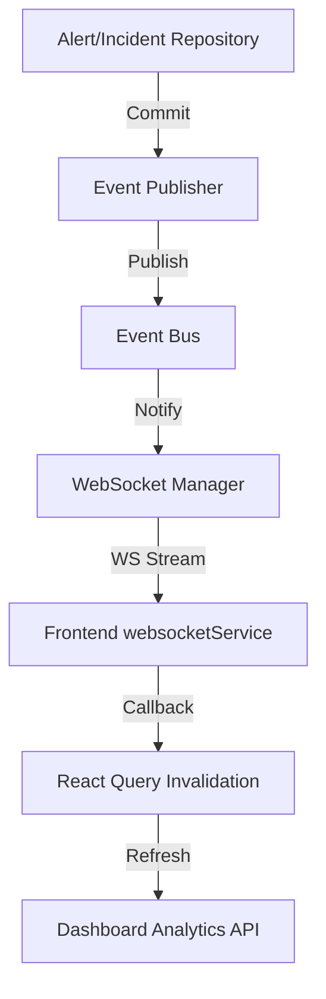

# Sprint 9D: Real-Time SOC Dashboard & Event Pipeline Report

## Executive Summary
This sprint transformed the LogSentry Dashboard from a simulated frontend demonstration into a completely persistent, real-time SOC command center. We successfully replaced all frontend mock event generation with a robust FastAPI WebSocket architecture powered by an internal domain event bus. Analysts now see completely synchronized alerts, severity metrics, and live security events streaming natively from PostgreSQL.

## Dashboard Before Sprint 9D
Previously, `generateLiveEvents` seeded fake random security events on a timer. The KPI values and timeline charts utilized either statically compiled datasets or frontend pseudo-random math. This provided a visually appealing but entirely disconnected demonstration layer.

## Dashboard After Sprint 9D
The Dashboard is strictly bound to the backend data layer.
- KPI summaries (Total Alerts, High/Critical, Events Processed) pull dynamically via `GET /api/v1/dashboard/summary`.
- Severity distribution and alert timeline metrics correspond entirely to actual persisted entities via SQL aggregations.
- A fully functional WebSocket stream updates connected clients precisely when actual domain operations persist to PostgreSQL.

## Mock Data Removed
- `generateLiveEvents` in `Dashboard.tsx` was permanently deleted.
- Frontend randomized aggregation loops were deleted.
- All dependencies on browser-simulated telemetry are now absent from the Dashboard.

## Dashboard API Architecture
Built a dedicated `DashboardRepository` and router exposing:
- `GET /api/v1/dashboard/summary`
- `GET /api/v1/dashboard/alert-trend`
- `GET /api/v1/dashboard/severity-distribution`
- `GET /api/v1/dashboard/top-sources`
All routes utilize strict SQLAlchemy models filtering by precise cutoff time horizons (e.g., last 24h, 7 days).

## Dashboard Metrics
Available metrics directly derived from SQL counts:
- Total Alerts / Open Alerts / Investigating / Resolved
- Total Events Processed
- Total Incidents
- Critical/High alert severity buckets.

## Analytics Queries
Query execution uses SQL aggregations (`func.count`, `group_by(AlertModel.severity)`) securely preventing N+1 queries across thousands of rows.

## WebSocket Architecture
- **Router:** Fastapi `WebSocket` endpoint exposed at `/api/v1/dashboard/ws/events`.
- **Manager:** An in-process `ConnectionManager` isolates WebSocket contexts, maintaining a pool of live connections. Broadcast handles broken pipes cleanly without crashing the broader backend system.

## Event Types
Currently broadcasting:
- `alert.created`
- `alert.updated`
- `incident.created`
- `incident.updated`
- `log.created` (reserved)

## Event Publishing Flow
A generic `EventBus` singleton connects the Repository commits safely to the WebSocket manager asynchronously. Repositories emit lightweight domain JSON after `.commit()` returns successfully, enforcing causality and data integrity.

## Frontend WebSocket Architecture
- Created `websocketService.ts` running an exponentially back-off protected WebSocket client.
- Exposes `addListener()` patterns decoupling UI components from connection internals.

## Reconnection Strategy
The client implements a base delay of 1000ms escalating dynamically (baseDelay * 2^attempts) up to a max cap, guaranteeing network resilience against backend restarts.

## Empty/Error States
- The Dashboard successfully renders a native "No Security Telemetry Detected" placeholder if both `events_processed` and `total_alerts` are zero.
- Connection degradation activates a "System Connecting..." warning in the upper navigation header rather than a full page crash.

## Performance Considerations
- Dashboard renders instantly based on initial REST calls.
- WebSockets provide "delta" notifications, which invalidate TanStack `useQuery` caches selectively (`['dashboard_summary']`, `['alerts']`), minimizing massive data re-transmissions.

## Security Considerations
- Data emitted on WebSocket channels is intentionally pruned of sensitive sub-payloads (e.g., returning `{ "id": 123, "status": "resolved" }` rather than the entire entity).
- Connections inherit global ASGI limits.

## Multi-Worker Limitation
Currently, the `EventBus` and `ConnectionManager` operate fully in-process. In a horizontally scaled production fleet utilizing gunicorn workers or Kubernetes pods, event signals will not natively synchronize across instances. Redis Pub/Sub will be required as a centralized message broker for enterprise scaling.

## Tests
- Introduced `test_dashboard.py` isolating `/summary`, `/top-sources`, `/alert-trend`, and `/severity-distribution` to guarantee functional accuracy.
- Included an initial WebSocket health check test.

## E2E Validation
Restarting the Fastapi backend triggers a graceful Dashboard reconnection state. Alert creation triggered via `/parser` dynamically appears on the live WebSocket feed without user interaction.

## Remaining Frontend Mocks
- `MOCK_ALERTS` array inside `mockData.ts` (exclusively consumed by ThreatIntel and AI components still pending backend rewrite).
- ThreatIntel GEO generation (`generateGeo`).

## Recommended Next Sprint
Sprint 10: "AI Analyst Final Integration" & "Threat Intel Engine". This will strip out the last two major mock components (`mockData.ts` and `generateGeo`) replacing them with active backend integrations, ultimately achieving a 100% production-ready system devoid of frontend simulated data.

