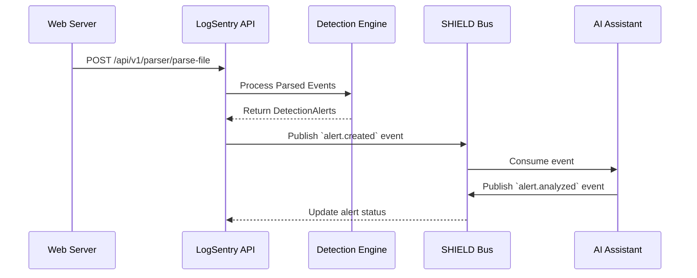

# S.H.I.E.L.D. Platform Architecture

LogSentry is designed as the flagship **Log Analysis and Detection Module** within the broader **S.H.I.E.L.D.** (Security Hub for Intelligence, Events, Logs, and Detection) ecosystem. 

S.H.I.E.L.D. represents a unified cybersecurity platform, integrating reconnaissance, detection, intelligence, and response into a single, cohesive architecture.

---

## 1. Overall S.H.I.E.L.D. Architecture

S.H.I.E.L.D. is composed of independent, highly cohesive microservices communicating through a shared event bus (planned for v2) and API Gateway.

```text
                               ┌──────────────────────────┐
                               │  Shared API Gateway &    │
                               │  Authentication Layer    │
                               └────────────┬─────────────┘
                                            │
        ┌───────────────────┬───────────────┼───────────────┬───────────────────┐
        │                   │               │               │                   │
┌───────▼───────┐   ┌───────▼───────┐ ┌─────▼─────┐ ┌───────▼───────┐   ┌───────▼───────┐
│               │   │               │ │           │ │               │   │               │
│  PortIntel    │   │  LogSentry    │ │  Threat   │ │  AI Security  │   │   Incident    │
│ (Network Recon) │ │ (Log Analysis)│ │  Intel    │ │  Assistant    │   │   Reporting   │
│               │   │               │ │           │ │               │   │               │
└───────────────┘   └───────────────┘ └───────────┘ └───────────────┘   └───────────────┘
        │                   │               │               │                   │
        └───────────────────┴───────────────┴───────────────┴───────────────────┘
                                            │
                               ┌────────────▼─────────────┐
                               │    S.H.I.E.L.D. Bus      │
                               │  (Kafka / RabbitMQ)      │
                               └──────────────────────────┘
```

### Module Responsibilities

1. **PortIntel**: Active network scanning, asset discovery, and vulnerability enumeration.
2. **LogSentry**: Passive log ingestion, real-time threat detection, and alert generation.
3. **Threat Intel**: Centralized intelligence cache (AbuseIPDB, OTX, MITRE) shared across modules.
4. **AI Security Assistant**: Automated alert triage, false-positive reduction, and remediation guidance.
5. **Incident Reporting**: Cross-module reporting engine (aggregating PortIntel scans and LogSentry alerts).

---

## 2. LogSentry Internal Architecture

LogSentry operates using a **Clean Architecture** pattern, ensuring strict separation of concerns and testability.

### Data Flow

```text
[Raw Log File / Stream] 
        │
        ▼
   (API Layer)          → RequestSizeLimitMiddleware (1MB Cap)
        │
        ▼
 (Service Layer)        → ParsingService (Apache, Nginx, Regex)
        │
        ▼               
  [LogEvent Model]      → Normalized Data Structure
        │
        ▼
 (Detection Engine)     → RuleRegistry (SQLi, XSS, Path Traversal, etc.)
        │
        ▼
[DetectionAlert Model]  → High-Confidence Attack Identifiers
        │
        ▼
 (EnrichmentService)    → AbuseIPDB, OTX AlienVault (Cached)
        │
        ▼
    (AIService)         → OpenAI / Gemini / Ollama (Contextual Analysis)
        │
        ▼
 (ReportingService)     → TimelineEngine → Executive/Technical/Incident Reports
        │
        ▼
   [Export Layer]       → PDF, CSV (ZIP), JSON
```

---

## 3. Cross-Module Integration (Future)

While currently standalone, LogSentry's `TimelineEngine` and `DetectionAlert` models are structured to act as data producers for the S.H.I.E.L.D. bus.

### Example Sequence: LogSentry -> AI Security Assistant



## 4. Design Decisions & Trade-offs

- **Stateless Services:** LogSentry relies heavily on dependency injection and stateless services to ensure it can be easily horizontally scaled in a containerized S.H.I.E.L.D. deployment.
- **In-Memory Cache vs Redis:** Currently uses an LRU `InMemoryCache` for threat intel. In a full S.H.I.E.L.D. deployment, this will be swapped for a shared Redis cluster.
- **Synchronous vs Asynchronous:** Parsing and Detection are synchronous (CPU bound), while AI and Enrichment are I/O bound. A future architectural iteration will move AI/Enrichment to Celery/ARQ workers for massive scale.
